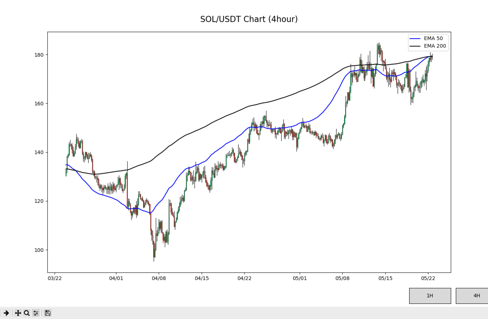

# Solana Price Tracker

## Overview
This project tracks Solana (SOL/USD) price data using a public crypto market API and visualizes short-term price trends using exponential moving averages (EMAs).

The goal of this project was to practice real-time data ingestion, time-series transformation, and financial data visualization.

## Features
- Fetches live SOL/USD price data via API
- Processes time-series price data
- Calculates 1-hour and 4-hour EMAs
- Visualizes price trends for short-term market analysis
- Includes sample output and chart visualization

## Tech Stack
- Python
- CoinGecko / KuCoin API
- Pandas
- NumPy
- Matplotlib

## How It Works
1. Pulls historical SOL/USD price data from the API
2. Cleans and formats the data into a usable time-series
3. Computes EMAs to smooth price movement
4. Plots price action alongside indicators

## What I Learned
- Working with external APIs
- Cleaning and transforming financial time-series data
- Applying technical indicators programmatically
- Building clear, readable data visualizations

## Example Output

## Future Improvements
- Store historical prices in a database
- Add additional indicators (VWAP, RSI)
- Build a dashboard-style UI
- Automate periodic data refresh

